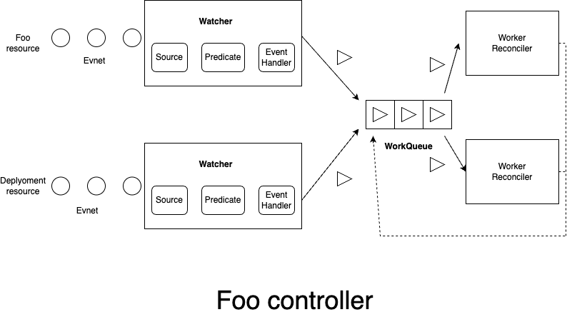

# foo-controller-k8s

## the importance of custom controller
Custom controllers are important tools in Kubernetes for managing custom resources and adapting cluster behavior to specific needs. They allow users to define and manage custom resources, automate tasks, and customize cluster operations. By incorporating business logic, they automate processes, improve system stability, and enhance scalability. Additionally, they extend Kubernetes' flexibility, enabling users to add new features and customize infrastructure to suit various use cases. In essence, custom controllers empower users to tailor Kubernetes clusters to their unique requirements and optimize their operations.
## Controller Overview
by deploying CustomResourceDefinitions (CRDs) and CustomResources (CRs), a deployment is automatically created using the name and replicas defined in the CustomResource. Furthermore, when the replicas field of the CustomResource is modified, the deployment is automatically updated accordingly. Similarly, deleting the CustomResource results in the deletion of the corresponding deployment as well.
### Foo Resource

### Foo Controller
the Reconcile process utilizes a loop to maintain the system in its intended state. It automates the following tasks using the name and replicas defined in the CustomResource:

1. Automatic creation of deployments.
2. Automatic recreation of deployments if they are deleted.
3. Updating deployments when the CustomResource definition is modified.
4. Updating the status of the CustomResource using the replicas of the deployment.

## How to use


Run localy

```
$ make install
$ make run
$ kubectl apply -f config/samples/samplecontroller_v1alpha1_foo.yaml
```

Run container as Deployment

```
$ make install
$ make deploy
$ kubectl apply -f config/samples/samplecontroller_v1alpha1_foo.yaml
```
